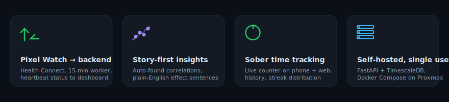

<p align="center">
  
</p>

<p align="center">
  Self-hosted personal health tracking &amp; analytics. <em>Single user.</em>
</p>

<p align="center">
  <a href="https://github.com/Pr0zak/myvitals/releases/latest"></a>
  <a href="https://github.com/Pr0zak/myvitals/actions/workflows/android-release.yml"></a>
  
  
  
</p>

---

<p align="center">
  
</p>

## What it does

Pulls your **Pixel Watch / Wear OS** data out of **Health Connect** on the phone, ships it to a **FastAPI + TimescaleDB** backend you run yourself, and renders a **Vue 3 + ECharts** dashboard on top. Optional **Claude AI layer** narrates your aggregate stats in plain English. No cloud SaaS — your data lives on hardware you own.

### Dashboard views

- **Today** — `✦` AI verdict headline, 🏋 pre-workout chip, statistical trend badges, readiness ring, KPI grid (HR, BP, sleep, recovery, steps, watch wear-time, sober counter), 24h heart-rate ribbon with sync-gap visualisation
- **Insights** — story-first feed of auto-discovered correlations with plain-English effect sentences, free-form `Ask` box ("what's hurting my sleep this month?"), `✦ Explain` button per finding for AI-narrated context
- **Trends** — long-term overlays (RHR / HRV / Recovery / Sleep) with sober-reset markers
- **Sleep / Weight / Blood pressure / Skin Δ** — dedicated views per metric
- **Sober time** — live `d/h/m/s` counter on the phone home screen with a 1.5s press-and-hold reset, full history with editable streaks, distribution + timeline charts on the web
- **Goals** — set targets (weight, sober streak, sleep, steps, custom) with per-goal AI coaching checks
- **Activities** — Strava sync + Garmin/Fitbit imports, GPS map view, side-by-side compare
- **Workout / Strength** — Fitbod-style generated session per day, filtered to your actual gear (dumbbell pairs, wrist-weight micro-loaders, bench config, etc.); per-set logging with rest timer; recovery-aware deload (reads HRV / sleep / readiness from `daily_summary` and adjusts target weights); deterministic seed so today's plan is stable until you tap regenerate; full set/rep/RPE history. **Equipment editor** (Settings → Strength equipment) drives catalog filtering — adding a doorway pull-up bar later auto-expands the catalog with no code change.
- **Log** — caffeine / alcohol / mood / food / meds, all editable inline (date/time included)
- **Calendar** — year heatmap, any metric
- **AI alerts banner** — anomaly detection cron flags z-score outliers; Claude phrases them, surfaces as colour-coded banners on every page until dismissed

Companion **Android app** does the heavy lifting: Health Connect reads on a 15-min `WorkManager`, retries via local Room buffer, posts a structured **sync heartbeat** to the backend so the dashboard can tell the difference between "phone is offline", "HC perms revoked", and "watch isn't pushing data". The home screen is the sober counter — large `d/h/m/s` ticker with a single press-and-hold-to-reset button.

### AI integration (opt-in)

Configured in Settings → AI (paste an Anthropic key, default model is Haiku 4.5):

- **Today's verdict** — one-sentence headline cached per data state
- **Targeted explainers** — week / month / sleep / recovery / sober / anomaly, each with structured output (headline + evidence + suggestion)
- **Free-form Q&A** — ask anything about your data
- **Discovery explainer** — plain-English read of any correlation
- **Pre-workout** — Go hard / Moderate / Easy / Rest recommendation
- **Goal coaching** — trajectory + leverage + ETA per goal
- **Weekly digest** — cron-scheduled Sunday 22:00 narrative
- **Anomaly cron** — every 6h, statistical detection → Claude phrasing → alerts banner
- **Post-workout review** — structured 4-field card (headline, highlights, concerns, next-session suggestion) generated on demand from a completed strength session, comparing against a trailing 4-week tonnage / RPE baseline
- **Tone** — Supportive / Blunt / Data-only

Bounded payload only: aggregate daily summaries, top correlations, profile (age range / sex / activity), workout details (no GPS), sober streak shape (no history dates). Never sent: raw HR samples, GPS tracks, exact sleep timestamps, the user's name/email, or sober history. Tap **Preview payload** in Settings to audit exactly what would be sent before enabling.

## Architecture

```
Pixel Watch 3
     │
     ▼  Health Connect
  Phone (Kotlin / Compose — Health Connect → WorkManager → Retrofit)
     │
     ▼  HTTP(S) bearer token              ↩ /ingest/heartbeat
  FastAPI ingest  ──►  TimescaleDB  ◄──── HA REST poller (env_readings)
     │                                         (optional)
     ▼
  Vue 3 + ECharts dashboard
   ├ Today (verdict + pre-workout + trend badges + KPI grid + ring)
   ├ Trends · Insights (AI Ask + Explain) · Goals (AI coaching)
   ├ Sleep · BP · Weight · Skin Δ · Activities (map / compare)
   ├ Sober · Calendar · Compare · Log · Logs
   └ Settings (token, units, theme, time format, profile, imports,
              Strava, AI key + model + tone + daily limit)

  ┌──────────────────────────────────────────────┐
  │ Optional Claude AI layer (Anthropic API)     │
  │  cron anomaly scan ─► ai_alerts ─► banners   │
  │  on-demand: verdict, ask, explain-discovery, │
  │  pre-workout, goal-check, batch all-topics   │
  │  weekly digest cron ─► ai_summaries cache    │
  │  prompt caching (system) for ~50% savings    │
  └──────────────────────────────────────────────┘
```

Full diagram in [`docs/architecture.md`](docs/architecture.md).

## Stack

| Layer    | Tech |
|----------|------|
| Backend  | FastAPI, SQLAlchemy 2.x, asyncpg, Alembic, APScheduler |
| DB       | PostgreSQL 16 + TimescaleDB |
| Frontend | Vue 3, Vite, ECharts, Lucide, Geist |
| Android  | Kotlin, Compose Material 3, Health Connect, WorkManager, Retrofit, Room, Timber |
| Deploy   | Docker Compose in a Proxmox LXC (unprivileged, runc 1.1.x) |
| CI       | GitHub Actions → GHCR images + signed APK on tag |
| Tooling  | uv (Python), pnpm (frontend) |

## Quickstart (local dev)

```bash
cp .env.example .env                         # set INGEST_TOKEN, QUERY_TOKEN, POSTGRES_PASSWORD
docker compose up -d db
cd backend && uv sync && uv run alembic upgrade head && uv run fastapi dev src/myvitals/main.py
# new terminal:
cd frontend && cp .env.example .env && pnpm install && pnpm dev
```

Open `http://localhost:5173`, paste your `QUERY_TOKEN` in Settings, and the dashboard wires up.

## Deploy

Production runs in an unprivileged Proxmox LXC with Docker Compose:

```bash
# Bootstrap a fresh CT (pulls runc 1.1.x to dodge the unprivileged-LXC sysctl bug)
deploy/ct-bootstrap.sh
```

See [`docs/operations.md`](docs/operations.md) for day-to-day commands and [`docs/releasing.md`](docs/releasing.md) for the keystore + GHCR + APK release flow.

## Repo layout

```
backend/                  FastAPI ingest + analytics + alembic migrations
  └─ src/myvitals/api/    ingest, query, summary, analytics,
                          ai (verdict / ask / explain-* / goals /
                          alerts / strength-review), sober, strava,
                          profile, exports, workout/strength
  └─ src/myvitals/data/   bundled exercise catalog (yuhonas/free-exercise-db,
                          public domain) — JSON + JPGs served via StaticFiles
frontend/                 Vue 3 dashboard
android/                  Kotlin / Compose companion app
deploy/                   ct-bootstrap.sh + upgrade.sh
.github/workflows/        images.yml (GHCR) + android-release.yml (signed APK)
docs/                     architecture / operations / releasing + images
TODO.md                   deferred work
```

